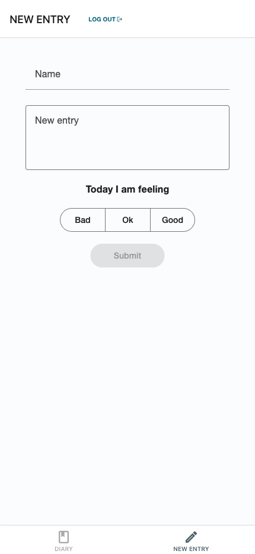

# mAI Diary

This repository contains an older Expo React Native app for AI-assisted diary writing.

The app flow is:

1. Register/Login with Firebase Auth.
2. Write a short daily summary and choose mood.
3. Fetch location + weather context.
4. Generate diary text (OpenAI Chat Completions).
5. Generate an image (OpenAI Images API).
6. Save the entry locally (native: JSON + downloaded image files, web: AsyncStorage + image URLs).

## Project status

This project is old and not actively maintained. Dependencies and API usage are outdated in places, but the codebase is useful as a starting point for refactoring.

## Tech stack

- Expo SDK 54 + React Native 0.81
- Expo Router (file-based routing)
- React Native Paper UI
- Firebase Auth (email/password)
- Expo FileSystem + AsyncStorage fallback (local diary storage)
- OpenAI API (text + image generation)
- WeatherAPI (daily weather context)
- Expo Location + AsyncStorage

## Environment variables

Create a `.env` file in the project root and provide:

```env
# Firebase
EXPO_PUBLIC_FIREBASE_API_KEY=
EXPO_PUBLIC_FIREBASE_AUTH_DOMAIN=
EXPO_PUBLIC_FIREBASE_PROJECT_ID=
EXPO_PUBLIC_FIREBASE_STORAGE_BUCKET=
EXPO_PUBLIC_FIREBASE_MESSAGING_SENDER_ID=
EXPO_PUBLIC_FIREBASE_APP_ID=
EXPO_PUBLIC_FIREBASE_MEASUREMENT_ID=

# OpenAI
EXPO_PUBLIC_OPEN_API_KEY=

# WeatherAPI
EXPO_PUBLIC_WEATHER_API_KEY=
```

Notes:

- The code uses `EXPO_PUBLIC_OPEN_API_KEY` (not `EXPO_PUBLIC_OPENAI_API_KEY`).
- `EXPO_PUBLIC_*` variables are bundled into the client app by Expo.

## Getting started

1. Install dependencies:

```bash
npm install
```

2. Start Expo:

```bash
npm run start
```

3. Launch on a target:

```bash
npm run ios
npm run android
npm run web
```

## Current app structure

```text
app/
  _layout.jsx              # Firebase init, root providers, stack routes
  landing.jsx              # Unauthenticated landing screen
  login.jsx                # Firebase login
  register.jsx             # Firebase register + diary file init
  (tabs)/
    _layout.jsx            # Auth gate + tab navigator
    index.jsx              # Diary list / delete entries
    entry.jsx              # New entry form + API calls
    result.jsx             # Review and save generated result
context/
  diaryContext.jsx         # Diary entries and save state
  apiContext.jsx           # API keys and generation state
utilities/
  diaryManager.jsx         # Native FS diary + web AsyncStorage fallback
```

## Screenshots

Creating an entry:


Example result:


## Data storage behavior

- Native (iOS/Android): diary entries are stored per-user in Expo FileSystem under:
  - `FileSystem.documentDirectory + "diaries/<uid>.json"`
- Native (iOS/Android): entry images are downloaded and stored locally under:
  - `FileSystem.documentDirectory + "diaries/<uid>/"`.
- Web: diary entries are stored per-user in AsyncStorage under keys like `diary:<uid>`.
- Web: image paths are stored as generated image URLs (no file download).
- Data is local to the device/app install (not synced to Firestore/DB).

## Known issues and outdated parts

- `npm run reset-project` is defined but `scripts/reset-project.js` does not exist.
- `npm test` is configured (`jest --watchAll`), but there are currently no test files.
- API keys are used directly from the client app (`EXPO_PUBLIC_*`), which is not secure for production.
- Some UI/logic is still prototype-level (minimal validation/error handling).

## Suggested next cleanup steps

1. Move OpenAI and weather requests behind a backend API.
2. Migrate diary persistence to a remote database with sync.
3. Add basic automated tests for auth flow and diary manager utilities.
4. Remove dead scripts and update dependencies to current Expo SDK.
